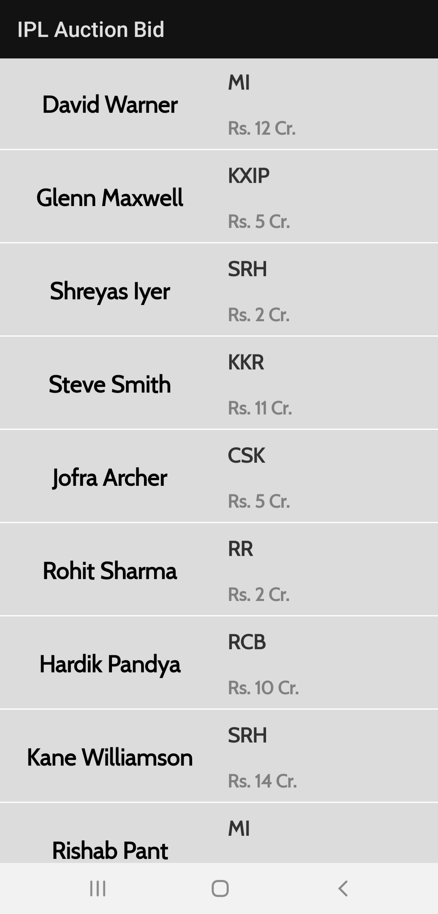
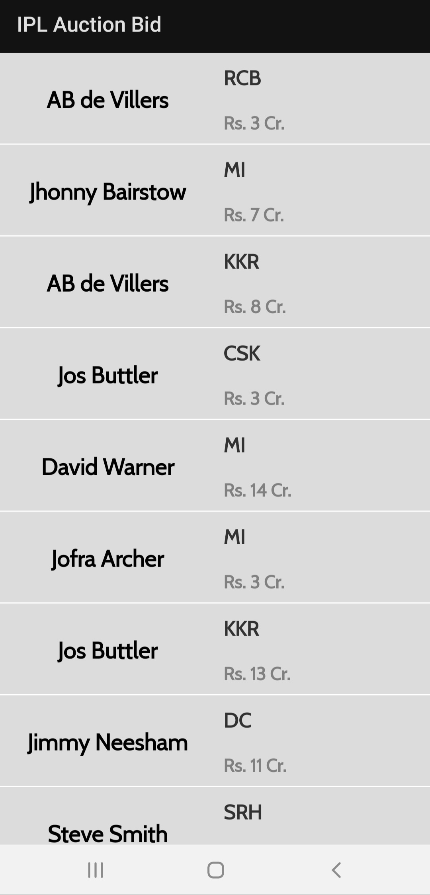

# IPL-Auction-Bid
A simple app using ListViews and Custom Adapter to display a complex list of items.

## About the App
This app prints the list of `IPL Players` and the `Teams` that have bid for them with their `Bid Amount`. It is just a small interesting concept to implement `ListView` using a `custom adapter` to display `complex data`. The data is chosen randomly using **Kotlin Random** class.

#### 1. Players List
<table>
  <tr>
    <td align="center"> <b> Player Name </b> </td>
    <td align="center"> <b> Country </b> </td>
  </tr>
  <tr>
    <td align="center"> Glenn Maxwell </td>
    <td align="center"> AUS </td>
  </tr>
   <tr>
    <td align="center"> David Warner </td>
    <td align="center"> AUS </td>
  </tr>
   <tr>
    <td align="center"> Steve Smith </td>
    <td align="center"> AUS </td>
  </tr>
   <tr>
    <td align="center"> Marcus Stoinis </td>
    <td align="center"> AUS </td>
  </tr>
  <tr>
    <td align="center"> Ben Stokes </td>
    <td align="center"> ENG </td>
  </tr>
   <tr>
    <td align="center"> Jos Butler </td>
    <td align="center"> ENG </td>
  </tr>
   <tr>
    <td align="center"> Jofra Archer </td>
    <td align="center"> ENG </td>
  </tr>
   <tr>
    <td align="center"> Jhonny Bairstow </td>
    <td align="center"> ENG </td>
  </tr>
  <tr>
    <td align="center"> AB de Villers </td>
    <td align="center"> SA </td>
  </tr>
   <tr>
    <td align="center"> Faf du Plessis </td>
    <td align="center"> SA </td>
  </tr>
   <tr>
    <td align="center"> Kane Williamson </td>
    <td align="center"> NZ </td>
  </tr>
   <tr>
    <td align="center"> Jimmy Neesham </td>
    <td align="center"> NZ </td>
  </tr>
  <tr>
    <td align="center"> Virat Kohli </td>
    <td align="center"> IND </td>
  </tr>
   <tr>
    <td align="center"> MS Dhoni </td>
    <td align="center"> IND </td>
  </tr>
   <tr>
    <td align="center"> Rohit Sharma </td>
    <td align="center"> IND </td>
  </tr>
   <tr>
    <td align="center"> Hardik Pandya </td>
    <td align="center"> IND </td>
  </tr>
  <tr>
    <td align="center"> Jasprit Bumrah </td>
    <td align="center"> IND </td>
  </tr>
   <tr>
    <td align="center"> Shreyas Iyer </td>
    <td align="center"> IND </td>
  </tr>
   <tr>
    <td align="center"> Shikar Dhawan </td>
    <td align="center"> IND </td>
  </tr>
   <tr>
    <td align="center"> Rishab Pant </td>
    <td align="center"> IND </td>
  </tr>
</table>

#### 2. Teams List
<table>
  <tr>
    <td align="center"> <b> Team Name </b> </tr>
  </tr>
  <tr>
    <td align="center"> MI </td>
  </tr>
  <tr>
    <td align="center"> CSK </td>
  </tr>
  <tr>
    <td align="center"> RCB </td>
  </tr>
  <tr>
    <td align="center"> KKR </td>
  </tr>
  <tr>
    <td align="center"> SRH </td>
  </tr>
  <tr>
    <td align="center"> RR </td>
  </tr>
  <tr>
    <td align="center"> DC </td>
  </tr>
  <tr>
    <td align="center"> KXIP </td>
  </tr>
</table>

#### 3. Player Bid Amount
The amount bid by the teams for any player is randomly chosen and is in the range `[2 , 16]`

### Screenshots of the App
<table>
  <tr>
    <td>  </td>
    <td>  </td>
  </tr>
</table>
